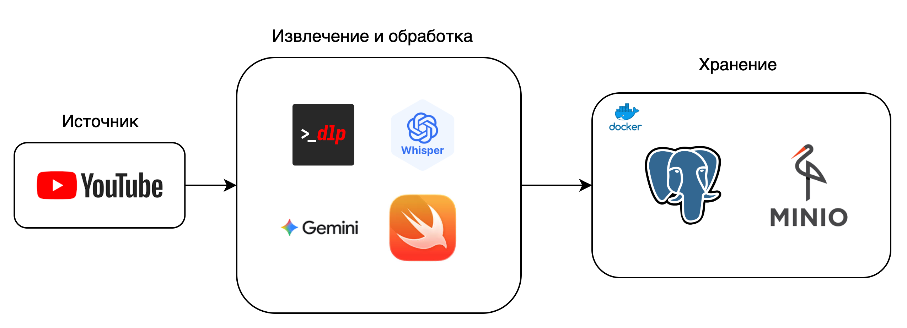

# Проект StandUP

Набор инструментов для обработки и анализа YouTube-контента в жанре юмористических шоу. 

Проект автоматизирует весь процесс: от загрузки видео из плейлистов и их транскрибации с помощью mlx-whisper до глубокого анализа контента. Используя нативные возможности Apple Silicon и фреймворк SoundAnalysis, система с высокой точностью определяет моменты смеха в аудиодорожках. Параллельно, с помощью Gemini API, извлекаются и классифицируются темы выступлений, что позволяет в дальнейшем создавать детальные метрики и дашборды для анализа популярности тем, реакции аудитории и других ключевых аспектов выступлений.

Работает исключительно на macOS с Apple Silicon.

## Реализовано



*   **PostgreSQL**: Реляционная база данных для хранения метаданных и результатов обработки.
*   **MinIO**: S3-совместимое объектное хранилище для аудиофайлов.
*   **Docker**: Контейнеризация сервисов (PostgreSQL, MinIO).
*   **yt-dlp**: Загрузка контента с YouTube.
*   **mlx-whisper**: Транскрибация аудио на Apple Silicon.
*   **SoundAnalysis**: Фреймворк Apple для анализа звука (используется для детекции смеха).
*   **Gemini API**: Большая языковая модель для анализа текста.
*   **Pydantic**: Валидация данных.

## Дополнительно (обязательно для запуска)
*   **openai-gemini**: Gemini ➜ OpenAI API proxy. Для работы с Gemini без использования VPN, требуется деплой и получение своего proxy URL согласно - https://github.com/PublicAffairs/openai-gemini. Полезное описание на русском - https://habr.com/ru/articles/798123/.

## Требуются доработки

### БД

**Опционально**
Выполнена одна денормализованная схема для хранения сырых данных после работы пайплайна. Трубется создать и заполнять нормализованную схему в Postgres.

### Пайплайн
1. Реализация классификации текста (~30 классов) через Gemini API. Интеграция в БД и настройка промта (требуемые техники промта: many-shots, CoT)
2. Разбиение монолитного main.py и общий рефакторинг:
- Операции с базой данных: настройка коннекта, коммитов, роллбеков
- Нормализовать имя функций и их описаний

## Планируется реализовать


## Планируемые метрики для дашборда:

Анализ выбранного шоу:
- Топ-10 популярных видео по(выбор): просмотры, лайки, кол-во комментариев
- Самые часто встречающиеся темы
- Топ-10 Тем по реакции (агрегация детекции смеха)
- Топ-10 видео по реакции (название, общее кол-во детекций смеха, общая продолжительность смеха, среднее время между смехом)
- Реклама (частота появления, попробовать вытащить бренды)
- Кол-во мата в видео/теме
- еще....

Переключатели: шоу, тема, год, комики...


## Структура проекта

```txt
StandUP_project
├── .env                        # Файл с переменными окружения
├── .gitignore                  # Файл для исключения файлов из Git
├── docker-compose.yml          # Конфигурация для запуска сервисов в Docker
├── initdb/
│   └── init_schema.sql         # SQL-скрипт для инициализации схемы БД
├── pyproject.toml              # Определение зависимостей и метаданных проекта
├── README.md                   # Документация проекта
├── data/
│   └── audio/                  # Директория для хранения временных аудиофайлов
└── src/
    ├── config.py               # Конфигурация проекта (пути, ключи, настройки)
    ├── database.py             # Функции для работы с базой данных PostgreSQL
    ├── llm.py                  # Функции для взаимодействия с Gemini API
    ├── main.py                 # Основной скрипт для запуска пайплайна
    ├── pydantic_models.py      # Pydantic-модели для валидации данных
    ├── sound_classifier        # Исполняемый файл Swift для анализа звука
    ├── sound_classifier.py     # Модуль для запуска Swift-скрипта анализа звука
    ├── sound_classifier.swift  # Исходный код Swift для анализа звука
    ├── transcribe.py           # Модуль для транскрибации аудио
    ├── utils.py                # Вспомогательные функции
    └── youtube_downloader.py   # Модуль для загрузки данных с YouTube
```


## Установка и запуск
0. **Обятазельно:** Выполнить деплой согласно - https://github.com/PublicAffairs/openai-gemini, получить proxy url и внести в .env файл.

1.  **Клонируйте репозиторий:**
    ```bash
    git clone <URL репозитория>
    cd StandUP_project
    ```

2.  **Создайте и настройте файл `.env`:**
    Создайте файл `.env` в корне проекта и заполнив его по следующему шаблону:
    ```env
    # PostgreSQL
    POSTGRES_DB=standup_db
    POSTGRES_USER=user
    POSTGRES_PASSWORD=password
    POSTGRES_HOST=localhost
    POSTGRES_PORT=5432

    # MinIO
    MINIO_ROOT_USER=minioadmin
    MINIO_ROOT_PASSWORD=minioadmin
    MINIO_DOMAIN=localhost:9000
    MINIO_AUDIO_BUCKET=audio-files

    # API Keys
    GEMINI_API_KEY=your_gemini_api_key

    # Proxy
    PROXY_URL=your_proxy_url
    ```

3.  **Запустите сервисы с помощью Docker Compose:**
    ```bash
    docker-compose up -d
    ```
    Эта команда запустит контейнеры с PostgreSQL и MinIO.

4.  **Установите зависимости Python:**
    ```bash
    uv sync
    ```

5.  **Запустите пайплайн:**
    Передайте URL плейлиста YouTube в качестве аргумента командной строки (url должен содержать часть "...&list=..."):
    ```bash
    uv run ./src/main.py "https://www.youtube.com/watch?v=MaVc3dqiEI4&list=PLcQngyvNgfmLi9eyV9reNMqu-pbdKErKr" 
    ```
