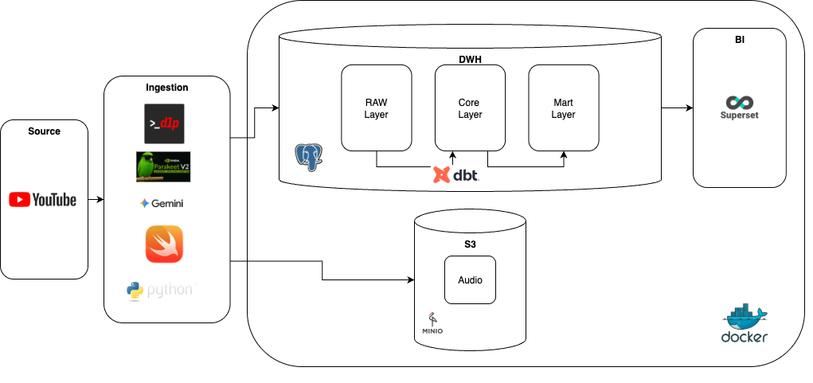
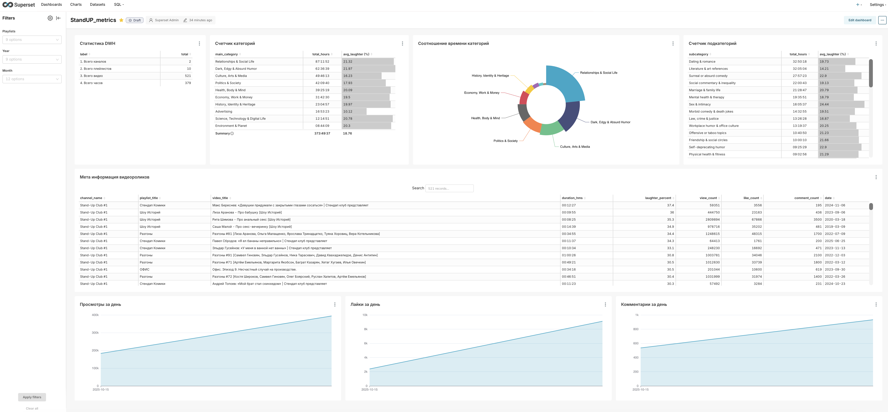

# StandUP Project

StandUP automates the ingestion and analysis of stand-up comedy playlists from YouTube. The pipeline downloads audio, transcribes routines, detects laughter events, summarises segments with Gemini, and materialises analytics-ready tables with dbt backed by PostgreSQL and MinIO storage.





## Highlights
- Automates YouTube playlist ingestion with `yt-dlp`, normalises metadata, and stores raw inputs in PostgreSQL.
- Caches audio artefacts in MinIO and on disk, avoiding re-downloads across pipeline runs.
- Transcribes shows locally with the Apple Silicon–optimised `parakeet-mlx` model and detects laughter via a Swift `SoundAnalysis` binary.
- Summarises chapters and classifies topics through the Gemini CLI, persisting structured JSON for downstream reporting.
- Ships a dbt project that populates core analytics tables via `uv run dbt run` after each ingestion step.

## Prerequisites
- **Hardware/OS:** Apple Silicon running macOS 14+ (required for `SoundAnalysis` and `parakeet-mlx`).
- **Python:** [`uv`](https://github.com/astral-sh/uv) with Python 3.13 toolchain installed locally.
- **Containers:** Docker Desktop (used for PostgreSQL and MinIO).
- **CLI tooling:**
  - [`yt-dlp`](https://github.com/yt-dlp/yt-dlp) (pulled automatically via `uv sync`).
  - [`ffmpeg`](https://ffmpeg.org/) on the host (`brew install ffmpeg`).
  - [Gemini CLI](https://ai.google.dev/gemini-api/docs/get-started) authenticated with Google account and available as the `gemini` executable.
- **Browser cookies:** Safari signed in to YouTube so `yt-dlp` can reuse session cookies.

## Setup
1. **Clone the repository**
   ```bash
   git clone <repository-url>
   cd StandUP_project
   ```
2. **Install Python dependencies**
   ```bash
   uv sync
   ```
   This pulls the Python 3.13 toolchain, `yt-dlp`, and the supporting CLIs pinned in `pyproject.toml`.
3. **Create a `.env` file** (values shown are local defaults):
   ```env
   # PostgreSQL
   POSTGRES_DB=standup_project
   POSTGRES_USER=standup_project
   POSTGRES_PASSWORD=standup_project
   POSTGRES_HOST=localhost
   POSTGRES_PORT=5432

   # MinIO
   MINIO_ROOT_USER=standup_project
   MINIO_ROOT_PASSWORD=standup_project
   MINIO_DOMAIN=localhost:9000

   # Optional overrides
   # DATA_DIR=./data
   # MINIO_AUDIO_BUCKET=standup-project
   # MINIO_AUDIO_PATH=data/audio
   ```
4. **Start infrastructure**
   ```bash
   docker-compose up -d
   ```
   This launches PostgreSQL, MinIO, and a bootstrap job that creates the `standup-project` bucket with a public policy. Stop services with `docker-compose down` when finished.

5. **Build the laughter detector binary**
   ```bash
   swiftc src/sound_classifier.swift -o src/sound_classifier
   ```

## Running the Ingestion Pipeline
Run the end-to-end processor with any YouTube playlist URL containing a `list=` parameter:
```bash
uv run src/main.py "https://www.youtube.com/watch?v=MaVc3dqiEI4&list=PLcQngyvNgfmLi9eyV9reNMqu-pbdKErKr"
```
The pipeline will:
- Upsert playlist entries into `standup_raw.process_video`.
- Check MinIO for cached audio before downloading via `yt-dlp`.
- Transcribe speech with `parakeet-mlx` and run the Swift laughter detector (`src/sound_classifier`).
- Call Gemini twice: once for chapter summaries, once for topic classifications.
- Mark rows as `process_status = 'finished'` when all artefacts are present.

## Analytics with dbt
Build analytics layers once ingestion finishes:
```bash
uv run dbt build
```
Key models include:
- `staging/stg_process_video.sql`: exposes raw JSON fields with typed columns.
- `core/*`: normalises transcripts, chapters, laughter scores, and classifications.

### Orchestrating dbt from Python
`main.py` shells out to `uv run dbt run` after each successfully processed video, so analytics tables stay in sync with new raw data. Trigger the same command manually when needed:


## Repository Layout
```text
StandUP_project
├── src/
│   ├── config.py             # Application settings loaded via config.Settings
│   ├── main.py               # End-to-end playlist processor
│   ├── youtube_downloader.py # yt-dlp wrapper with MinIO caching helpers
│   ├── transcribe.py         # Parakeet transcription wrapper
│   ├── sound_classifier.py   # Python client that wraps the Swift binary at src/sound_classifier
│   ├── sound_classifier.swift # Source for rebuilding the Swift binary
│   ├── sound_classifier      # Compiled Swift laughter detector binary (ignored)
│   ├── llm.py                # Gemini CLI prompts and client helpers
│   ├── database.py           # Psycopg repository for standup_raw.process_video
│   ├── models.py             # Pydantic models for pipeline entities
│   └── utils.py              # Shared logging utilities and cache cleanup
├── analyses/                # dbt analysis queries for ad hoc exploration
├── macros/                  # dbt macros shared across models
├── models/                  # dbt models (staging, core, marts)
├── seeds/                   # dbt seed data for reference tables
├── snapshots/               # dbt snapshots for slowly changing data
├── dbt_project.yml          # dbt project definition
├── dbt_packages/            # Third-party dbt packages installed via dbt deps (ignored)
├── dbt_internal_packages/   # Auto-generated dbt dependencies (ignored)
├── target/                  # Compiled dbt artifacts (ignored)
├── docker/
│   └── superset/            # Superset deployment assets
├── initdb/
│   └── init_schema.sql      # Database bootstrap schema for raw/core layers
├── docker-compose.yml       # Local PostgreSQL, MinIO, Superset stack
├── pyproject.toml           # Python project configuration
├── .env                     # MinIO/PostgreSQL Configuration (ignored)
├── uv.lock                  # Locked dependency manifest for uv (ignored)
├── data/                    # Local audio cache (ignored)
├── logs/                    # Execution logs and dbt state (ignored)
├── AGENTS.md                # Agent orchestration notes
├── standup_project.drawio   # Architecture diagram source (ignored)
├── image.png                # Pipeline overview illustration
└── README.md
```


## Development Workflow
- Keep configuration in `src/config.py`; prefer adding settings there instead of reading environment variables ad hoc.
- Log via the standard library `logging` module—`main.py` configures default formatting.

## Database & Storage
- `initdb/init_schema.sql` mirrors the structure expected by the pipeline and dbt models; update it alongside any schema changes.
- MinIO bucket defaults to `standup-project` with audio stored under `data/audio/<title>.opus`.
- Processed transcripts, chapters, classifications, and laughter scores are intermediate JSON blobs which dbt flattens into core tables.

## Troubleshooting
- **yt-dlp errors:** Ensure Safari is running and signed into the correct YouTube account so cookie extraction succeeds.
- **Gemini CLI issues:**
  - **Authenticate for non-interactive mode:** Complete the interactive login first so the CLI can cache credentials, then export the environment variables below (otherwise the 1,000 messages/day quota is not applied).
    ```bash
    Gemini GOOGLE_CLOUD_PROJECT
    export GOOGLE_APPLICATION_CREDENTIALS="/Users/aleksandr/.config/gcloud/application_default_credentials.json"
    export GOOGLE_CLOUD_PROJECT="gen-lang-client-123456789"
    ```
    Read more about environment configuration in the Gemini CLI docs:
    - https://google-gemini.github.io/gemini-cli/docs/get-started/authentication.html
    - https://github.com/google-gemini/gemini-cli/blob/main/docs/get-started/configuration.md
  - **Daily quota reset:** Gemini CLI rate limits reset at 00:00 Pacific Time.
