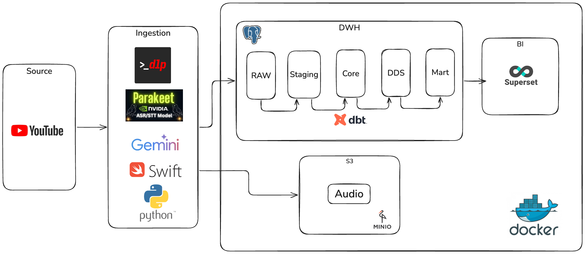
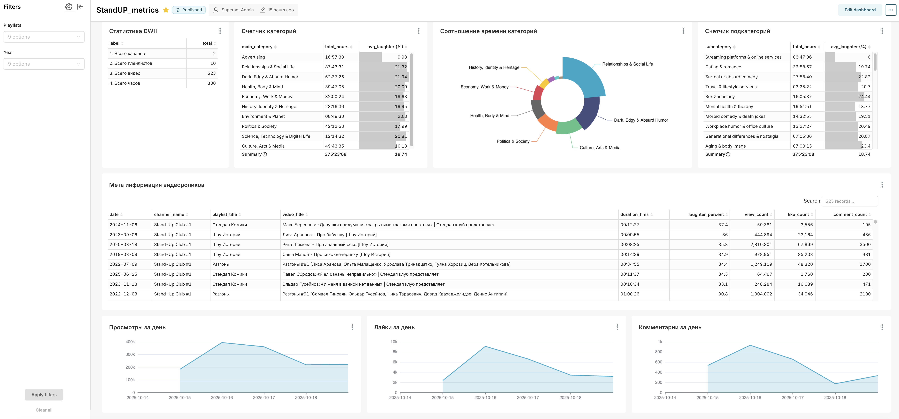

# StandUP Project

StandUP automates the ingestion and analysis of stand-up comedy playlists from YouTube. The pipeline downloads audio, transcribes routines, detects laughter events, summarises segments with Gemini, and materialises analytics-ready tables with dbt backed by PostgreSQL and MinIO storage.





## Highlights
- Automates YouTube playlist ingestion with `yt-dlp`, normalises metadata, and stores raw inputs in PostgreSQL.
- Orchestrates playlist processing with `src/data_pipeliine.py`, resuming unfinished videos and refreshing stale metadata without repeating completed steps.
- Caches audio artefacts in MinIO and on disk, avoiding re-downloads across pipeline runs.
- Transcribes shows locally with the Apple Silicon–optimised `parakeet-mlx` model and detects laughter via a Swift `SoundAnalysis` binary.
- Summarises chapters and classifies topics through the Gemini CLI, persisting structured JSON for downstream reporting.
- Runs dbt incremental marts in the `standup_marts` schema and executes `dbt run`/`dbt test` automatically whenever new data lands.
- Bundles an Apache Superset container preconfigured to the analytics schema for dashboarding at `http://localhost:8088`.

## Prerequisites
- **Hardware/OS:** Apple Silicon running macOS 14+ (required for `SoundAnalysis` and `parakeet-mlx`).
- **Python:** [`uv`](https://github.com/astral-sh/uv) with Python 3.13 toolchain installed locally.
- **Containers:** OrbStack (used for PostgreSQL/MinIO/Superset).
- **CLI tooling:**
  - [`yt-dlp`](https://github.com/yt-dlp/yt-dlp) (pulled automatically via `uv sync`).
  - [`ffmpeg`](https://ffmpeg.org/) on the host (`brew install ffmpeg`).
  - [Gemini CLI](https://ai.google.dev/gemini-api/docs/get-started) authenticated with Google account and available as the `gemini` executable.
- **Browser cookies:** Safari signed in to YouTube so `yt-dlp` can reuse session cookies.

## Setup
1. **Clone the repository**
   ```bash
   git clone <repository-url>
   cd StandUP_project
   ```
2. **Install Python dependencies**
   ```bash
   uv sync
   ```
   This pulls the Python 3.13 toolchain, `yt-dlp`, and the supporting CLIs pinned in `pyproject.toml`.
3. **Create a `.env` file** (values shown are local defaults):
   ```env
   # PostgreSQL
   POSTGRES_DB=standup_project
   POSTGRES_USER=standup_project
   POSTGRES_PASSWORD=standup_project
   POSTGRES_HOST=localhost
   POSTGRES_PORT=5432

   # MinIO
   MINIO_ROOT_USER=standup_project
   MINIO_ROOT_PASSWORD=standup_project
   MINIO_DOMAIN=localhost:9000

   # Optional overrides
   # DATA_DIR=./data
   # MINIO_AUDIO_BUCKET=standup-project
   # MINIO_AUDIO_PATH=data/audio

   # Superset (optional)
   SUPERSET_ADMIN_USER=admin
   SUPERSET_ADMIN_PASSWORD=admin
   SUPERSET_ADMIN_EMAIL=admin@example.com
   SUPERSET_SECRET_KEY=standup-secret-key
   ```
4. **Start infrastructure**
   ```bash
   docker-compose up -d
   ```
   This launches PostgreSQL, MinIO, Superset, and a bootstrap job that creates the `standup-project` bucket with a public policy. Stop services with `docker-compose down` when finished.

5. **Build the laughter detector binary**
   ```bash
   swiftc src/sound_classifier.swift -o src/sound_classifier
   ```
   Re-run this after any changes to `src/sound_classifier.swift`.

## Running the Ingestion Pipeline
Register a new playlist (or resume unfinished ones) with:
```bash
uv run src/main.py --new_playlist "https://www.youtube.com/watch?v=lgP8ZjQeAAY&list=PLcQngyvNgfmKSmmu9lJNoLo6K2MVfIS40"
```
Omit `--new_playlist` to iterate through playlists already stored in `standup_raw.process_video`.

The orchestrator in `src/data_pipeliine.py`:
- Upserts playlist entries and refreshes per-video metadata daily when necessary.
- Downloads audio only when transcripts or laughter features are missing, then runs transcription and the Swift laughter detector.
- Calls Gemini for summaries and classifications once transcripts are available, storing structured JSON payloads.
- Marks rows as `process_status = 'finished'` when all artefacts are present so downstream models can filter on completed videos.
- Triggers `src/dbt_run.py` to execute `uv run dbt run` followed by `uv run dbt test` whenever any video was updated.

## Analytics with dbt
Build analytics layers once ingestion finishes:
```bash
uv run dbt build
```
This command seeds the calendar dimension, materialises incremental models, and runs tests.

Key artefacts include:
- `models/staging/stg_videos_base.sql`: filters the raw table to videos whose `process_status = 'finished'`.
- `models/core/*`: normalises transcripts, chapters, laughter scores, classifications, and lookup tables with enforced contracts and constraints.
- `models/marts/dim/*.sql`: incremental dimensions mapped to the `standup_marts` schema and backed by the same unique keys as the core layer.
- `models/marts/fact/*.sql`: incremental fact tables for chapters, daily metrics, and snapshot metrics that depend on `dim_date` and other dimensions.
- `seeds/dim_date.csv`: a 10-year calendar used to join upload and snapshot dates across facts (updated automatically via `dbt build`, or with `uv run dbt seed` if run standalone).

### Orchestrating dbt from Python
`main.py` delegates to `src/dbt_run.py`, which runs `uv run dbt run` followed by `uv run dbt test` whenever at least one video changes. Trigger the same commands manually when needed:

## Visualising in Superset
- Visit `http://localhost:8088` (default credentials `admin` / `admin` unless overridden in `.env`).
- Explore datasets under the `standup_marts` schema, starting with `fact_video_metrics` for laughter and engagement trends.
- Build or import dashboards; Superset runs alongside PostgreSQL in Docker Compose so no extra connection steps are required.


## Repository Layout
```text
StandUP_project
├── src/
│   ├── config.py             # Application settings loaded via config.Settings
│   ├── main.py               # CLI entry point that delegates to run_pipeline()
│   ├── data_pipeliine.py     # Orchestrates playlist ingestion and per-video processing
│   ├── youtube_downloader.py # yt-dlp wrapper with MinIO caching helpers
│   ├── transcribe.py         # Parakeet transcription wrapper
│   ├── sound_classifier.py   # Python client that wraps the Swift binary at src/sound_classifier
│   ├── sound_classifier.swift # Source for rebuilding the Swift binary
│   ├── sound_classifier      # Compiled Swift laughter detector binary (ignored)
│   ├── llm.py                # Gemini CLI prompts and client helpers
│   ├── database.py           # Psycopg repository for standup_raw.process_video
│   ├── models.py             # Pydantic models for pipeline entities
│   ├── dbt_run.py            # Helper that executes dbt run/test with structured logging
│   └── utils.py              # Shared logging utilities and cache cleanup
├── analyses/                # dbt analysis queries for ad hoc exploration
├── macros/                  # dbt macros shared across models
├── models/                  # dbt models (staging, core, marts)
├── seeds/                   # dbt seed data (dim_date calendar)
├── snapshots/               # dbt snapshots for slowly changing data
├── dbt_project.yml          # dbt project definition
├── docker/
│   └── superset/            # Superset deployment assets
├── initdb/
│   └── init_schema.sql      # Database bootstrap for the raw ingest table
├── docker-compose.yml       # Local PostgreSQL, MinIO, Superset stack
├── pyproject.toml           # Python project configuration
├── .env                     # MinIO/PostgreSQL Configuration (ignored)
├── data/                    # Local audio cache (ignored)
└── README.md
```


## Development Workflow
- Keep configuration in `src/config.py`; prefer adding settings there instead of reading environment variables ad hoc.
- Log via the standard library `logging` module—`main.py` configures default formatting.

## Database & Storage
- `initdb/init_schema.sql` provisions the raw schema and table; dbt is responsible for creating the `standup_core` and `standup_marts` objects during materialisation.
- MinIO bucket defaults to `standup-project` with audio stored under `data/audio/<title>.opus`.
- Processed transcripts, chapters, classifications, and laughter scores are intermediate JSON blobs which dbt flattens into core tables.

## Troubleshooting
- **yt-dlp errors:** Ensure Safari is running and signed into the correct YouTube account so cookie extraction succeeds.
- **Gemini CLI issues:**
  - **Authenticate for non-interactive mode:** Complete the interactive login first so the CLI can cache credentials, then export the environment variables below (otherwise the 1,000 messages/day quota is not applied).
    ```bash
    Gemini GOOGLE_CLOUD_PROJECT
    export GOOGLE_APPLICATION_CREDENTIALS="/Users/aleksandr/.config/gcloud/application_default_credentials.json"
    export GOOGLE_CLOUD_PROJECT="gen-lang-client-123456789"
    ```
    Read more about environment configuration in the Gemini CLI docs:
    - https://google-gemini.github.io/gemini-cli/docs/get-started/authentication.html
    - https://github.com/google-gemini/gemini-cli/blob/main/docs/get-started/configuration.md
  - **Daily quota reset:** Gemini CLI rate limits reset at 00:00 Pacific Time.
